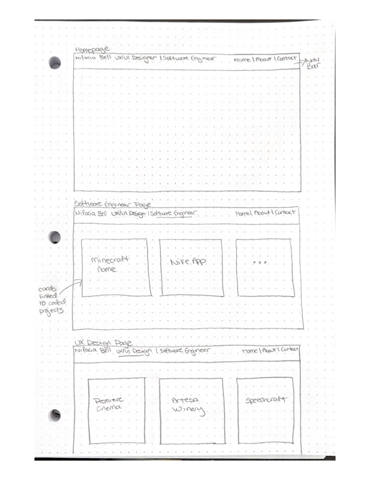
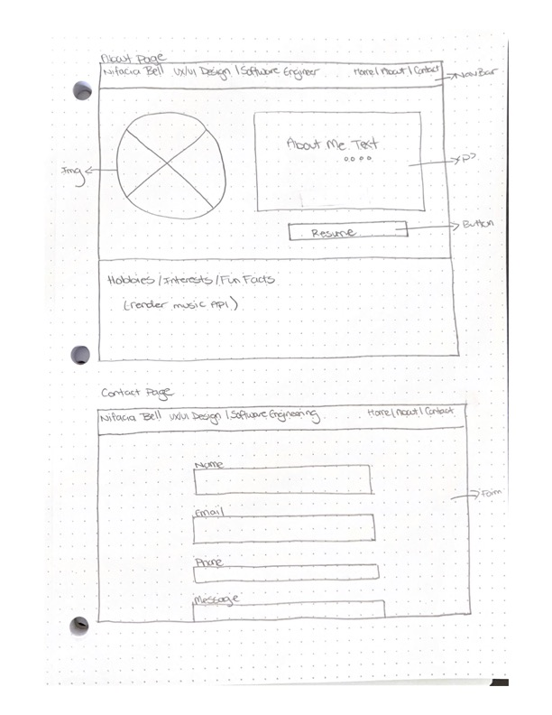

# My Portfolio App

This project was bootstrapped with [Create React App](https://github.com/facebook/create-react-app).

## About Me

This project is to showcase my portfolio that highlights my Software Engineering and UX Design skills, special talents, interest and hobbies for you to get to know me! 

### Available Scripts

In the project directory, you can run:

### `npm start`

Runs the app in the development mode.\
Open [http://localhost:3000](http://localhost:3000) to view it in your browser.

The page will reload when you make changes.\
You may also see any lint errors in the console.

or you can see the live website hosted by Netlify (found in the Deployment section of READme file) 

## Wireframes
 
 Approach : Wireframing was key in designing the layout of my portfolio. It was also important to stay organize since I had severals pages to code. I kept a detailed checklist of everything I need to do to create a functioning website. Previous I have focused on the UI but I wanted to take my time to create an app that was functional. 

### Learn More

You can learn more in the [Create React App documentation](https://facebook.github.io/create-react-app/docs/getting-started).

To learn React, check out the [React documentation](https://reactjs.org/).

### Technologies 

To create this project I used Axios, this library allowed my to consume data from my Spotify API. 

For styling I used Bootstrap React to create my NavBar and some buttons. 

### Making a Progressive Web App

This section has moved here: [https://facebook.github.io/create-react-app/docs/making-a-progressive-web-app](https://facebook.github.io/create-react-app/docs/making-a-progressive-web-app)

### Deployment

[Live link to Portfolio](https://nifaciabellportfolio.netlify.app)

### Next Steps / Unsolved Problems

For my portfolio I would like to add all of my software engineer and ux designs projects. Create a cohesive layout and implement more API's. And showcase more of my personality by working on UI and adding cool animations and images. 

